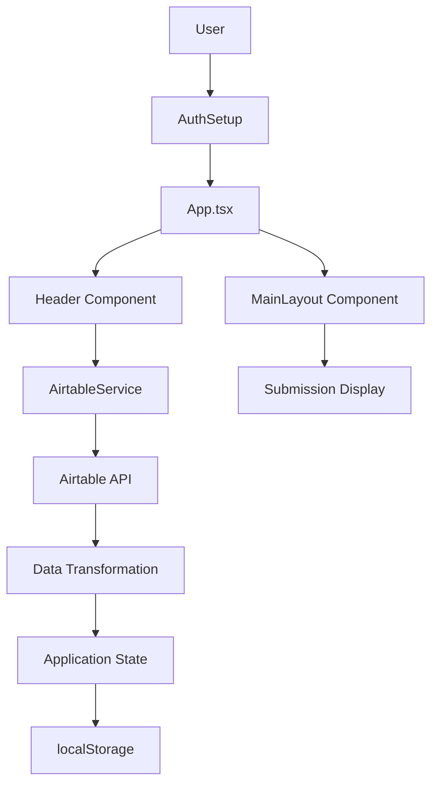

# Project Overview

Sidekick is a React-based hackathon review application designed for evaluating projects from online hackathons. It integrates with Airtable as the primary database for submission management and Hackatime for time tracking, specifically built to handle YSWS (You Ship, We Ship) hackathon submissions with automated data fetching, review workflows, and submission management.

## Repository Structure

- `src/` – Main application source code including components, services, types, and utilities
- `src/components/` – React components including authentication, header navigation, and main layout
- `src/components/ui/` – Reusable UI components like accordions, cards, and expandable text
- `src/services/` – External API integrations, primarily Airtable service for data operations
- `src/types/` – TypeScript type definitions for submission data and configuration
- `src/utils/` – Utility functions for data transformation and submission processing
- `public/` – Static assets and favicon served by Vite
- `dist/` – Production build output directory
- `node_modules/` – npm dependencies

## Build & Development Commands

```bash
# Install dependencies
npm install

# Build for production
npm run build

# Lint code
npm run lint
```

## Code Style & Conventions

- **Formatting**: ESLint with TypeScript, React Hooks, and React Refresh plugins
- **Quotes**: Double quotes with template literals allowed
- **Semicolons**: Required (`"semi": ["error", "always"]`)
- **Naming**: Function declarations preferred over arrow functions for main components
- **Props**: Inline prop types rather than separate interface declarations
- **Comments**: Avoid excessive code comments; prefer self-documenting code
- **TypeScript**: Strict type checking enabled with separate app and node configs

## Architecture Notes



The application follows a straightforward React architecture where the main App component manages global state including authentication configuration and submission data. The AirtableService handles all external API communication, transforming raw Airtable records into typed YswsSubmission objects. Authentication credentials and base configurations persist in localStorage. The Header manages base selection and displays submission counts, while MainLayout handles the submission list and detail views with expandable content using DaisyUI components.

## Extensibility Hooks

- **Environment Variables**: > TODO: Document supported environment variables
- **Service Layer**: AirtableService can be extended for additional Airtable operations
- **Component System**: UI components in `src/components/ui/` designed for reusability
- **Type System**: Submission types easily extendable for additional hackathon formats
- **Base Filtering**: Currently filters for "YSWS" bases; pattern adaptable for other events
- **Data Transformation**: Utility functions support custom field mappings between Airtable and app schema
